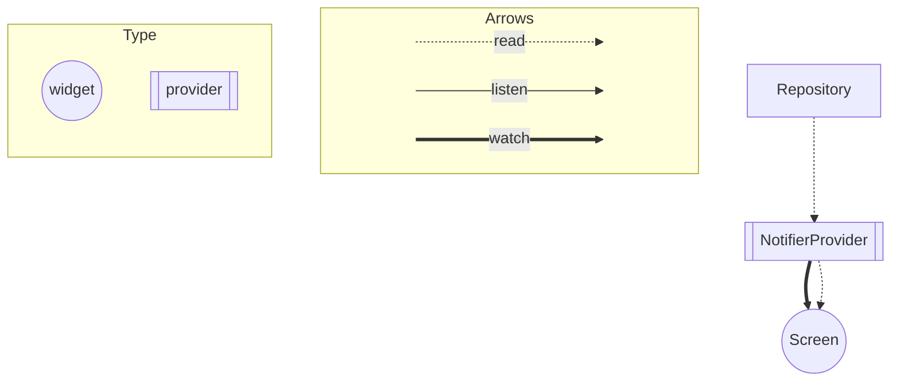

# Architecture

## 基本方針
- 可能な限りシンプルな構造、設計を保つ
- freezed, riverpod を利用して、可能な限り immutable にする

## ディレクトリ構造

- `data` : Model, Entity を配置する。freezed による自動生成の対象
  - `generated` : 自動生成されたファイルが格納される
- `gen` : `assets.gen.dart` など自動生成されたファイルが配置される
- `presentation` : View に関するクラスが格納される
    - `common` : 複数画面から利用されるクラスyが格納される
    - `screen` : 各画面に関するクラスが格納される。1 画面 1 ディレクトリとする
      - `xxx` : 画面 xxx に関するクラスが格納される
        - `generated` : 自動生成されたファイルが格納される
- `repository` : API 通信、DB とのやりとりを司る Repository を配置する
  - `generated` : 自動生成されたファイルが格納される

## 依存関係

